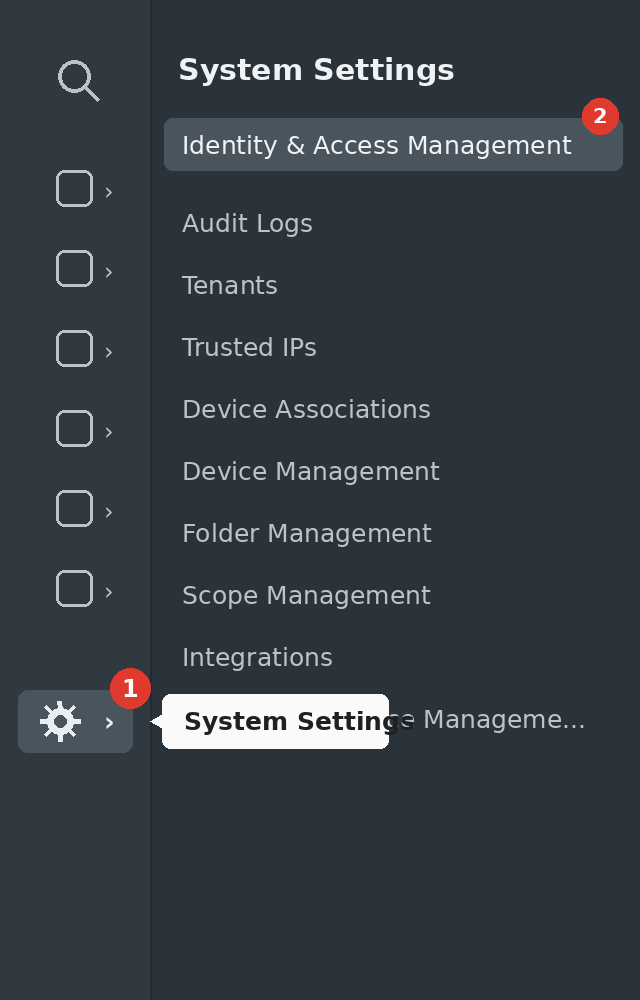
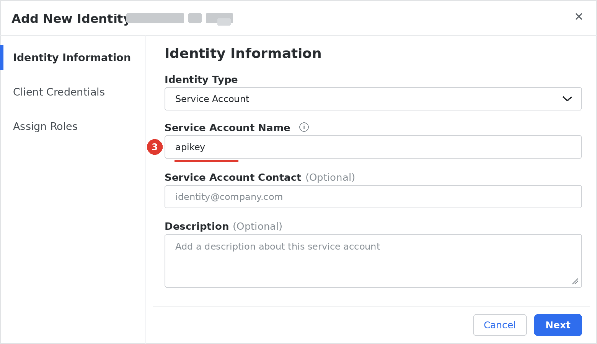
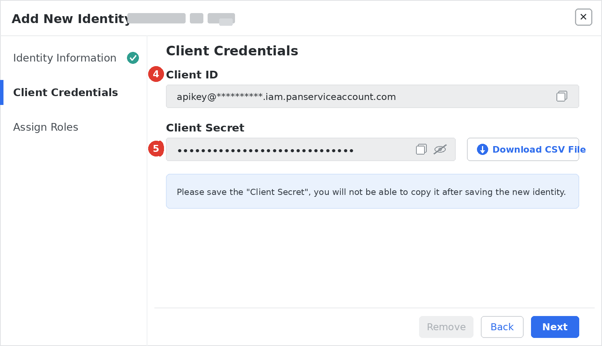
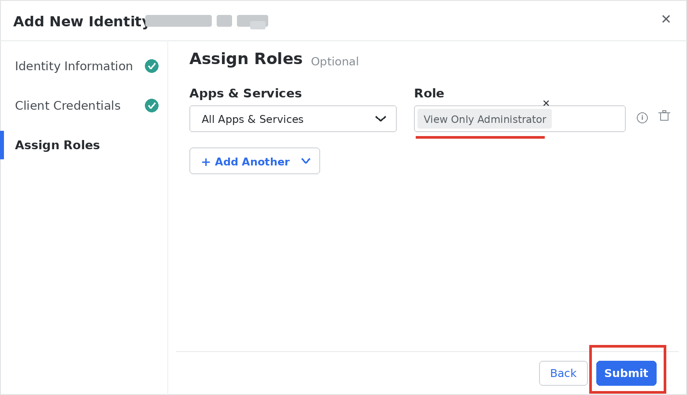

# Prisma SASE plugin — the `prisma-sase-ops` Skill

This plugin ships **one thing: the `prisma-sase-ops` Skill** — the decision
tree for choosing between the Prisma SASE tools, the thresholds for reading
their numbers, diagnostic runbooks, and a weekly-report template.

**The tools themselves are not in here.** Since 0.9.0 the read-only MCP server
installs separately, as a Local MCP server launched through `uvx`, so it
updates itself on every app restart instead of waiting for a plugin update.

**Install `uv` and `git` first** — both, before anything else. `brew install uv
git` on macOS; on Windows `winget install astral-sh.uv` then `winget install
Git.Git`, and open a new terminal so `PATH` is re-read. Confirm with:

```bash
uvx --version && git --version
```

You do **not** need Python — uv supplies its own interpreter. With those two in
place, one command sets the server up:

```bash
uvx --from git+https://github.com/eric2q/prisma-sase-plugin prisma-sase-setup
```

Full install instructions, prerequisites and the update model are in the
[repository README](../README.md) ([繁體中文](../README.zh-TW.md)) — including
[launching without a network](../README.md#launching-without-a-network), which needs a pinned commit
SHA because every launch re-resolves the git ref. This page is the reference
material: the API-key walkthrough, credential storage, troubleshooting, and
every environment variable.

> **Read-only by design.** Every tool only *queries*. There is no write /
> commit / config-push path anywhere (design doc sec.10.1).

### Tools the Skill drives

| Tool | What it answers |
|---|---|
| `get_sase_status` | One-shot health: alerts by severity, tunnels up/down, connected users, ADEM score |
| `query_alerts` | Alerts by severity / state / time window (paginated) |
| `get_connected_users` | Connected Mobile Users: total, trend, by location |
| `get_user_experience` | ADEM experience score — overall or a named user/app, with LAN/WiFi/DNS/app breakdown |
| `get_remote_networks` | Per-tunnel status rows (RN/SC): up/down, site, throughput; filter `state="down"` |
| `discover_insights` | Diagnostic: probe which Insights resource/view names your tenant actually accepts (read-only) |

These sit on 2 of the ~15 Prisma SASE API families PANW publishes (Insights
3.0 + ADEM). The full landscape — every family on pan.dev, what's covered
today, what's a read-only Phase-2 candidate (Service Status, ADEM app metrics,
Aggregate Monitoring for MSP, SD-WAN monitor, Subscription quotas), and what
the read-only design excludes (all `/sse/config` + push/jobs) — is catalogued
in
[`skills/prisma-sase-ops/references/api-catalog.md`](skills/prisma-sase-ops/references/api-catalog.md).

## If the tools don't show up

**First, check whether you installed the other half.** Installing this plugin
gives you the Skill and *no tools* — that is the normal intermediate state, not
a broken install. If you have not run `prisma-sase-setup` yet, run it; if you
have, restart the app completely (macOS ⌘Q — closing the window does not
relaunch MCP servers).

Then, in order:

1. **Run the server by hand.** It prints what it found, and never a credential
   value:
   ```bash
   uvx --from git+https://github.com/eric2q/prisma-sase-plugin prisma-sase-mcp --selfcheck
   ```
   A missing `uvx` on `PATH` is the most common cause of a server that never
   starts: the app does not give MCP servers a login shell's `PATH`, which is
   why the generated entry sets `PATH` explicitly. If `which uvx` prints
   somewhere not in that list, add it.

   ⚠️ A `credentials: MISSING` line in a hand-run selfcheck is **expected** and
   does not mean you are unconfigured. The Local MCP entry's `env` block is
   visible only to the server process the app launches, never to your shell.

2. **Ask Claude to run `prisma_sase_setup_required`.** When the real server
   can't start (missing dependencies, Python too old), a dependency-free
   fallback server takes its place and exposes this single tool; calling it
   returns the diagnosis and the copy-paste fix. Its description alone already
   names the problem.

3. **Read the launch breadcrumb: `~/.prisma-sase-launch.log`.** Written by the
   `run.sh` launch path and by the server itself:

   | Line | Meaning |
   |---|---|
   | *file missing entirely* | nothing ever launched — the Local MCP entry is absent, misspelled, or the host has not been restarted |
   | `run.sh invoked ...` | launch started (venv path) |
   | `WARNING: ... not executable (broken venv?)` | a venv interpreter is dangling (typically after a Python upgrade) — recreate it, or move to `uvx` |
   | `launching with <path>` | the interpreter that was chosen |
   | `FATAL: ...` | the exact cause of death (no Python ≥ 3.10, version floor, missing packages) |

4. **Check you edited the config the app actually reads.** A machine can have
   more than one Claude build installed, each with its own directory and its
   own config: `Claude-3p/` is the **custom-gateway** build, plain `Claude/`
   is the **subscription** one. Both are ordinary installs — neither is the
   wrong one — but each reads only its own file, so configuring the build you
   don't run looks like it worked and produces no tools. To see which exist:
   ```bash
   ls -d ~/Library/Application\ Support/Claude*
   ```
   `prisma-sase-setup` scans for all of them and, when there is more than one,
   lists them — labelled by build — and asks which to write. It does not
   guess, because nothing on disk reveals which one you work in. Configure
   both by running it twice. To skip the question (or when running
   unattended), set `PRISMA_PANEL_CONFIG=<path> prisma-sase-setup`.

   (Linux: `~/.config/Claude*`. Windows: both `%APPDATA%\Claude*` **and**
   `%LOCALAPPDATA%\Claude*` — builds differ on which they use, and a
   `Claude-3p` install was found under `Local` in the field.)

5. **`Git executable not found`.** uv's own message, and it has two quite
   different causes. Tell them apart by *where* you saw it:

   **In your own terminal, running `prisma-sase-setup`** — then it means what
   it says: git is not installed. Every command here installs `--from
   git+https://…`, so uv shells out to git to resolve the ref. Install it
   (`winget install Git.Git` on Windows, `xcode-select --install` on macOS)
   and **open a new terminal** so `PATH` is re-read. Nothing below applies.

   **In the MCP log, at app launch, on a machine where `git --version` works**
   — that is the other one, and it is not a `PATH` problem, so adding git to
   `PATH` again changes nothing. Read on.

   (A third failure shares the enclosing *"Git operation failed"* line but
   **not** the *"executable not found"* one: with no network, an unpinned entry
   dies at `Updating … (HEAD)`. That is the offline case — see the
   troubleshooting table.)

   The app passes the server only a fixed list of environment variables
   (`APPDATA`, `PATH`, `SYSTEMROOT` and a handful more). **`PATHEXT` is not on
   that list**, so it does not exist in the server process — and with no
   `PATHEXT`, Windows appends nothing when resolving a bare command name.
   `git` is looked up as a literal filename and never matches `git.exe`.

   The fix is one line in the entry's `env`, which `prisma-sase-setup` now
   writes for you. If you built the entry by hand, add:
   ```
   PATHEXT=.COM;.EXE;.BAT;.CMD;.VBS;.JS;.WSF;.MSC
   ```

## Getting the API key — a read-only service account

The API key is a service account's **Client ID + Client Secret**, created in
Strata Cloud Manager (SCM) in four steps (figures are schematic redrawings;
tenant identifiers masked; red badges ①–⑤ number the flow):

1. **Open Identity & Access Management** — gear icon (System Settings, ①) at
   the bottom of SCM's left menu → **Identity & Access Management** (②) →
   **Add Identity** (a three-page wizard opens).

   

2. **Identity Information** — Identity Type = **Service Account**; pick a
   recognizable name (③, e.g. `apikey` — it becomes the Client ID prefix) →
   Next.

   

3. **Client Credentials** — the **Client ID** (④) and **Client Secret** (⑤)
   are generated on the spot. ⚠️ **The secret is shown only this once** —
   copy it immediately or **Download CSV File** (store in a password manager,
   delete the file). Lost secrets can only be rotated. The digits after `@`
   in the Client ID **are the TSG ID** — no separate lookup. → Next.

   

4. **Assign Roles** — labeled Optional but **required** (no role = HTTP 403):
   Apps & Services = **All Apps & Services**, Role = **View Only
   Administrator** → Submit. That covers everything this plugin does; don't
   grant Superuser or any writable role (least privilege). MSP/multi-tenant:
   create the identity under the correct TSG scope.

   

Never paste the Client Secret into a chat — the tools take no credential
parameters by design; if a secret leaks, rotate it in SCM and update wherever
it is stored.

## Where the four values live

The server resolves them in a fixed order, and the first source that supplies
a value wins:

```
1. environment        -- the Local MCP entry's `env` block, injected by the host
2. env file           -- ~/.prisma-sase.env, only for values step 1 did not supply
3. PRISMA_SECRET_CMD  -- only if the Client Secret is still unset
```

An empty string counts as *not supplied*, so a blank key in the entry falls
through to the file rather than silently winning.

**Ranked by how well each protects the secret:**

1. **`PRISMA_SECRET_CMD`** — the entry (or env file) holds a *command*, and
   the secret itself stays in your OS keychain. The only arrangement where the
   secret is not stored in readable form anywhere. This is what
   `prisma-sase-setup` configures by default:

   ```bash
   PRISMA_SECRET_CMD=security find-generic-password -s prisma-sase -a client_secret -w   # macOS
   # secret-tool lookup service prisma-sase key client_secret           # Linux
   # pass show prisma-sase/client_secret                                # pass
   # op read "op://Private/prisma-sase/client secret"                   # 1Password
   ```

   On **Windows** the store is DPAPI, driven through PowerShell — there is no
   `security` equivalent, and `cmdkey` will not print a password back, so it
   cannot serve as a fetch command. `prisma-sase-setup` keeps the encrypted
   blob in `%LOCALAPPDATA%\prisma-sase\` and emits the PowerShell that
   decrypts it. DPAPI binds the blob to *this user on this machine*: copying
   it elsewhere yields a file nobody can read. It is `-Command`, not `-File`,
   so an execution policy of `AllSigned` or `Restricted` does not block it.

   `bash setup-keychain.sh` (shipped in `src/prisma_sase_mcp/`) wires this by
   hand if you prefer: it prompts for the secret hidden — never as a
   command-line argument, which `ps` would expose — stores it, and writes the
   matching env file. Modes: `--show`, `--remove`, `--stdin`.

2. **The Local MCP servers entry's `env` block.** ⚠️ It is settings UI, but it
   is **not secure storage** — the values are written as plain JSON in the
   host's config file. Fine for the Client ID, TSG ID and region; think twice
   before putting the secret there.

3. **`~/.prisma-sase.env`** (`chmod 600`) — the fallback wherever there is no
   panel: cloud sessions, CI, hand-installed checkouts. It is also the home for
   the non-credential `PRISMA_*` tuning variables listed at the end of this
   page, which no UI covers.

   ```bash
   # ~/.prisma-sase.env  -- chmod 600
   PRISMA_CLIENT_ID=apikey@1234567890.iam.panserviceaccount.com
   PRISMA_CLIENT_SECRET=...
   PRISMA_TSG_ID=1234567890
   PRISMA_REGION=sg
   ```

   The file is read no matter how the app was launched, which is what makes it
   a dependable fallback on macOS: GUI apps started from Finder/Dock/Spotlight
   are **not guaranteed to inherit `launchctl setenv` variables** — on many
   machines they simply never arrive (field-verified), so exporting the four
   values into your shell is not a reliable substitute. Custom location:
   `PRISMA_ENV_FILE`.

**Verify any time**, without revealing anything:

```bash
uvx --from git+https://github.com/eric2q/prisma-sase-plugin prisma-sase-setup --show
uvx --from git+https://github.com/eric2q/prisma-sase-plugin prisma-sase-mcp --selfcheck
```

## When the tools report missing credentials

`get_sase_status` reports this as `credentials_not_supplied`, with a `kind`:

| `kind` | What happened | What fixes it |
|---|---|---|
| `expanded_empty` | The values arrived as **empty strings** — set, but with nothing in them. Usually a blank `env` key in the Local MCP entry | Re-run `prisma-sase-setup`, or fill the blank key in by hand |
| `unexpanded` | A literal `${...}` came through — something copied a template without substituting it | Replace the placeholder with the real value in the entry |

Both are **configuration** problems — `whose_fault: "configuration"`, never a
tenant outage and never something in the plugin. No change to the API key or
the tenant can fix a value that arrived blank.

**Not on this list, deliberately:** "no credentials visible at all." Since
0.9.0 that is what a *correct* install looks like from outside the server
process, so it is not diagnosed as a fault. Through 0.8.x it was, because the
plugin declared `userConfig` and an install with no `pluginConfigs` entry
therefore meant the enable dialog never ran. Removing `userConfig` made that
inference false. (Historical record:
[BUG-REPORT-userconfig-dialog-never-shown.md](../BUG-REPORT-userconfig-dialog-never-shown.md).)

## First run against a real tenant

The shipped defaults are **live-verified** (users/users_list,
tunnels/tunnel_list, alerts/alerts_list — all confirmed against a real tenant),
so on a comparable tenant things should work out of the box. Two open items:

- **Per-alert severity**: some tenants expose `alerts/alerts_list` as an
  *aggregate* view (counts only). `query_alerts` reports honest summary counts
  until the per-alert "detail" view is identified — run
  `discover_insights(kind="alerts_detail")` once and adopt the suggestion.
- **Different tenant/version?** If any Insights tool returns HTTP 400, run full
  discovery — ask Claude to run `discover_insights`, or from a terminal:

  ```bash
  uvx --from git+https://github.com/eric2q/prisma-sase-plugin prisma-sase-mcp --discover
  ```

  It probes candidates read-only, uses a documented control probe to separate
  auth problems from naming problems, and prints a `suggested_insights_map` to
  adopt as one line (`PRISMA_INSIGHTS_MAP`) in your Local MCP entry or env
  file; then restart the Claude app.

## Try it offline first (no credentials)

Set `PRISMA_MOCK=1` (in the entry's `env`, or `~/.prisma-sase.env`) and every
tool runs on sample data through the real code path — good for a first look or
a customer demo.

## Troubleshooting

| Symptom | Cause | Fix |
|---|---|---|
| Skill loads but no SASE tools exist | You installed the plugin but not the server — they are separate halves since 0.9.0 | Run `prisma-sase-setup`, then restart the app fully |
| `uvx: command not found` in the host's MCP logs | The app does not give MCP servers a login shell's `PATH` | The generated entry sets `PATH` explicitly; if you wrote the entry by hand, add the directory `which uvx` reports |
| Tools missing right after fixing anything | MCP servers are only relaunched on a **full app restart** | macOS **⌘Q** (closing the window is not enough), then reopen. Windows: quit from the tray, not just the window |
| First launch is slow | uvx is fetching this repo plus two dependencies, then caching them | Subsequent launches reuse the cache; only a new commit triggers a rebuild |
| Behind a corporate proxy, uvx cannot fetch | No proxy in the server's environment | Add `HTTPS_PROXY=http://proxy:port` to the entry's `env` block |
| `Updating … (HEAD)` then `Failed to resolve` / `Git operation failed`, with no network | Every launch re-resolves the git ref, so an unpinned entry needs the network **each time it starts** — a warm cache does not help, and neither does `--offline` | Pin a **full 40-char commit SHA** in the `--from` URL and warm the cache once while online. A tag (`@v0.9.1`) is *not* enough: tags can move, so uv still contacts the remote. See [Launching without a network](../README.md#launching-without-a-network) |
| "Missing required context / Missing PRISMA_CLIENT_ID…" although `launchctl getenv` shows values | macOS GUI apps launched from Finder/Dock are not guaranteed to inherit `launchctl setenv` (field-verified) | Put the values in the Local MCP entry's `env`, or `~/.prisma-sase.env`. `--selfcheck` shows which source supplied each value |
| Insights tool returns HTTP 400 | Resource/view name or filter-payload shape doesn't match this tenant (the client already auto-tries time-filter and empty-filter variants) | Run `discover_insights` (or `--discover`), adopt the `suggested_insights_map` |
| Alerts show only counts, `severity_unavailable: true` | The per-alert severity view (`prisma_sase_external_alerts_current`, tried automatically first) did not return usable rows, so the tool fell back to the aggregate view | `discover_insights(kind="alerts_detail")` probes the candidates; if none work, capture the real view name from the SASE UI (dev tools → Network — step-by-step in the Skill's `references/endpoints.md`, "When discovery finds nothing") and set `PRISMA_INSIGHTS_MAP`; please report working names so they become shipped defaults |
| Insights 400 with `DATA10003` / "Invalid resource" | The resource/view **name does not exist** on this tenant | Run `discover_insights` for working names; adopt its suggestions |
| Insights 400 with `GCP10002` / "Unrecognized name: X" | The view **exists** — only field `X` in the payload is wrong | Don't change the view name; fix the property via `PRISMA_FILTER_TIME_PROP` / `_SEVERITY_PROP` / `_STATE_PROP` |
| Insights 400 with "SELECT list must not be empty" | The query sent an empty SELECT — this can 400 even on an existing view | Discovery probes with `properties:["*"]` (always valid) precisely to avoid this trap; report it if a regular tool hits it |
| Alerts show severity `unknown` (detail view) | The tenant's severity field name differs from the candidates tried | The response's `field_note` lists the record's real fields — set `PRISMA_FILTER_SEVERITY_PROP` and report the field name |
| An answer carries `plugin_update_pending` | The host kept an old server process alive across an update — that answer came from **old code** | Restart fully; don't debug behaviour the newer version may already have fixed |
| Tool answers include a `_verify` note | Insights resource/view names not yet confirmed for your tenant | Confirm once, then set `PRISMA_INSIGHTS_MAP` (see `skills/prisma-sase-ops/references/endpoints.md`) |

### Windows

Nothing platform-specific is left in the plugin: `uvx` is the launcher on every
OS, so there is no per-OS package variant any more (0.8.x shipped three).
Install uv with `winget install astral-sh.uv` and git with
`winget install Git.Git` — uv shells out to git to resolve the `git+https://`
ref, and a fresh Windows image has neither. Open a new PowerShell afterwards so
`PATH` is re-read, run the same `prisma-sase-setup` command, and restart Claude
from the tray.

Credentials go in the same places. `chmod 600` doesn't apply on Windows; the
env file sits in your user profile, which NTFS already restricts to you plus
administrators.

#### Windows on ARM

There is one extra flag to pass, and it belongs on the **very first** command
you run — the setup command itself. Use this instead of the one at the top of
this page:

```powershell
uvx --managed-python --python cpython-3.12-windows-x86_64 `
    --from git+https://github.com/eric2q/prisma-sase-plugin prisma-sase-setup
```

Everything after that is automatic: the wizard detects ARM64 and carries the
same two flags into the entry it writes, so the server launches the same way.

Why. `cryptography` arrives as a transitive dependency (`fastmcp` → `mcp` →
`pyjwt[crypto]`) and its authors publish no `win_arm64` wheel for the current
version. Under a native interpreter uv therefore builds it from source, which
needs a Rust toolchain and the MSVC C++ build tools; without them the command
fails with a `cargo`, `rustc` or linker error that names nothing to do with
this plugin. `prisma-sase-setup` and the server ship in the same package, so
the dependency — and the failure — is the same for both. That is why the
bootstrap command needs the flags too: at that moment the wizard has not run
yet and cannot fix anything on your behalf.

Running under an **x64** interpreter sidesteps it entirely: Windows on ARM
emulates x64, the `win_amd64` wheels exist, nothing is compiled. The entry the
wizard writes reads:

```json
"args": ["--managed-python", "--python", "cpython-3.12-windows-x86_64",
         "--from", "git+https://github.com/eric2q/prisma-sase-plugin",
         "prisma-sase-mcp"]
```

uv downloads and manages that interpreter itself, so no separate Python install
is needed — and since uv publishes no ARM64 Windows build at all,
`--managed-python` can only give you x64 here anyway.

Two things that look like fixes and are not. `winget install Python.Python.3.12
--architecture x64` does nothing: winget matches on package ID, sees 3.12
already installed, and stops. And installing x64 Python by any means is not
sufficient on its own, because uv picks its own interpreter and prefers the
native one unless told otherwise.

Staying native means supplying the build tools —
`winget install Rustlang.Rustup Microsoft.VisualStudio.2022.BuildTools` — which
works, but is a much longer road to the same place. None of this applies on
Intel/AMD Windows.

## Cloud sessions: getting credentials in

Remote/cloud sessions (Cowork web, remote containers) run in a sandbox that
**cannot read your laptop's home directory** — `~/.prisma-sase.env` does not
follow you there, and two intuitive paths fail in confusing ways:

- **Attaching the dotfile to the chat** silently fails: Finder hides dotfiles,
  so the picker often sends nothing while you believe it was sent.
- **Authorizing your home directory root** is typically not allowed.

The supported path — stage a **non-dotfile copy** into a folder you can
authorize/attach, then point the server at it:

```bash
# on your Mac: copy WITHOUT the leading dot so it is visible & attachable
cp ~/.prisma-sase.env ~/Documents/<your-project>/prisma-sase.env
```

In the cloud session, set `PRISMA_ENV_FILE` to wherever the staged copy landed:

```bash
PRISMA_ENV_FILE=/path/to/prisma-sase.env
```

⚠️ **Storage principles (apply everywhere, not just cloud):**

- Credentials live in exactly one of the **supported homes** — OS keychain via
  `PRISMA_SECRET_CMD`, the Local MCP entry, or the env file (`chmod 600`) —
  and **nowhere else**.
- **Never** commit them to a git repo, keep copies in project folders beyond a
  session, sync them to shared drives/cloud storage, or paste the Client Secret
  into any conversation — a secret in chat is a secret in the transcript.
  (Settings UI and a terminal prompt are not the conversation; filling those in
  is fine.)
- The cloud-staged copy above is a **temporary working copy**, not a second
  home — delete it as soon as the session's work is done.
- If a secret is ever exposed, **rotate it in SCM** (IAM → service account →
  regenerate) and update wherever it is stored; deleting the leaked copy does
  not un-leak it.

Deliberately, credentials do **not** auto-sync to the cloud; staging is a
manual, visible act. No credentials at hand? `PRISMA_MOCK=1` runs every tool
offline with realistic sample data.

## Uninstalling

Because the two halves install separately, they uninstall separately.

**The Skill:**

```bash
claude plugin uninstall prisma-sase@prisma-sase
claude plugin marketplace remove prisma-sase
```

**The server** — delete the `prisma-sase` entry from **Settings → Extensions →
Local MCP servers** (or from `claude_desktop_config.json`), then clear what is
left in your home directory. Neither the host nor uvx knows about these:

| Left behind | Size |
|---|---|
| `~/.cache/uv/` entries for this repo | tens of MB (shared with other uvx tools — `uv cache clean` if you want it all gone) |
| `~/.prisma-sase-venv` (only if you used the pre-0.9.0 venv install) | ~100 MB |
| `~/.prisma-sase.env` (and any hand-made copies) | credentials |
| `~/.prisma-sase-launch.log` | tiny |
| the keychain entry, if you used `PRISMA_SECRET_CMD` | — |

The bundled script lists everything first and asks before deleting:

```bash
bash uninstall.sh              # show the plan, then confirm
bash uninstall.sh --dry-run    # just show
bash uninstall.sh --yes --keep-credentials
```

(It ships in `src/prisma_sase_mcp/`; `bash setup-keychain.sh --remove` deletes
the stored secret.)

If a credential file ever sat on disk in plaintext — especially with
permissions looser than 600 — **rotate the secret in SCM**. Deleting the file
does not undo the exposure. `--selfcheck` warns about both loose permissions
and stray `~/.prisma-sase*.env` copies the server never reads.

## All environment variables

Set these in the Local MCP entry's `env` block, or in `~/.prisma-sase.env`.

| Variable | Required | Purpose |
|---|---|---|
| `PRISMA_CLIENT_ID` / `PRISMA_CLIENT_SECRET` | ✅ | service account credentials — prefer `PRISMA_SECRET_CMD` for the secret, and never commit either |
| `PRISMA_TSG_ID` | ✅ | default Tenant Service Group id (the digits after `@` in the Client ID) |
| `PRISMA_REGION` | ✅ | `X-PANW-Region` header value (e.g. `sg`, `us`, `de`) |
| `PRISMA_SUBTENANT_ID` | — | adds `Prisma-SubTenant` header |
| `PRISMA_MOCK` | — | `1` = offline mock mode |
| `PRISMA_ENV_FILE` | — | custom env-file path (default `~/.prisma-sase.env`) |
| `PRISMA_SECRET_CMD` | — | command whose stdout supplies the Client Secret (keychain / secret-tool / pass / `op read`); used only when `PRISMA_CLIENT_SECRET` is otherwise unset |
| `PRISMA_PYTHON` | — | absolute path of the interpreter for the legacy `run.sh` launcher (uvx ignores it) |
| `PRISMA_INSIGHTS_MAP` | — | JSON override of Insights resource/view names once confirmed |
| `PRISMA_FILTER_TIME_PROP` / `_SEVERITY_PROP` / `_STATE_PROP` | — | override Insights filter property names |
| `PRISMA_ADEM_ENDPOINT_TYPE` | — | ADEM `endpoint-type` (default `muAgent`) |
| `PRISMA_LOG_LEVEL` | — | `DEBUG` / `INFO` (default) / `WARNING` |

## Security

- The service account is **read-only** and bound only to the needed TSG(s); the
  server has no write capability, so there is no config-drift risk.
- The Client Secret lives in your keychain, the host's config, or a `chmod 600`
  env file — never in this package, never in logs, never in tool responses.
- Each tool call is audit-logged (time, tool, parameter summary) to stderr; the
  token and response bodies are **not** logged.
- Query results can include user names — confirm your data-handling policy
  before demoing against a customer tenant.
- `uvx` runs code fetched from GitHub at launch. That is what makes updates
  automatic, and it means the repo is a supply-chain dependency: install from a
  source you trust, or pin a ref (`…@v0.9.0`) if you need a frozen target.

## What's inside / Roadmap

```
plugin/                            # <- this package: the Skill, and nothing else
├── .claude-plugin/plugin.json     # manifest: no mcpServers, no userConfig, by design
├── README.md                      # this page
├── CHANGELOG.md                   # version history: FIX / NEW / CHG per release
└── skills/prisma-sase-ops/        # decision tree, thresholds, runbooks, weekly report
    └── references/                # endpoints.md, api-catalog.md

src/prisma_sase_mcp/               # <- the other half: what uvx builds and runs
```

- **Phase 1 (this)** — 6 read-only tools over stdio + the ops Skill.
- **Phase 2** — SD-WAN tools, config-snapshot audit, richer multi-tenant.
- **Phase 3** — weekly-report automation, streamable-HTTP deployment, optional
  Prisma AIRS MCP security demo.

## 關於本專案與免責聲明 / About & Disclaimer

**中文** — 本專案作者任職於 Palo Alto Networks,職務為 Solutions Consultant。
這是作者為了向客戶推廣 Prisma SASE、以個人時間開發的 **side project**:
**並非 Palo Alto Networks 官方開發、維護或背書,不代表公司立場;
內容與查詢結果亦不保證正確性、完整性或適用性** —— 使用前請自行評估,
重要決策請以官方文件與官方支援管道為準。本專案以開源方式發佈
(MIT License,見 the repository's LICENSE file),歡迎透過 GitHub Issues / PR
提出任何意見與回饋,也歡迎**無償**引用、修改與再利用。

**English** — The author works at Palo Alto Networks as a Solutions
Consultant. This is a personal **side project** built on personal time to
help introduce Prisma SASE to customers. **It is not developed, maintained,
or endorsed by Palo Alto Networks and does not represent the company; no
guarantee is made as to the correctness, completeness, or fitness of its
content or query results** — evaluate before use, and rely on official
documentation and support channels for important decisions. The project is
open source under the MIT License; feedback and contributions
are welcome via GitHub Issues / PRs, and everyone is free to use, modify,
and reference it at no cost.

*Palo Alto Networks、Prisma 及相關標誌為 Palo Alto Networks, Inc. 之商標。
Palo Alto Networks, Prisma, and related marks are trademarks of
Palo Alto Networks, Inc.*
